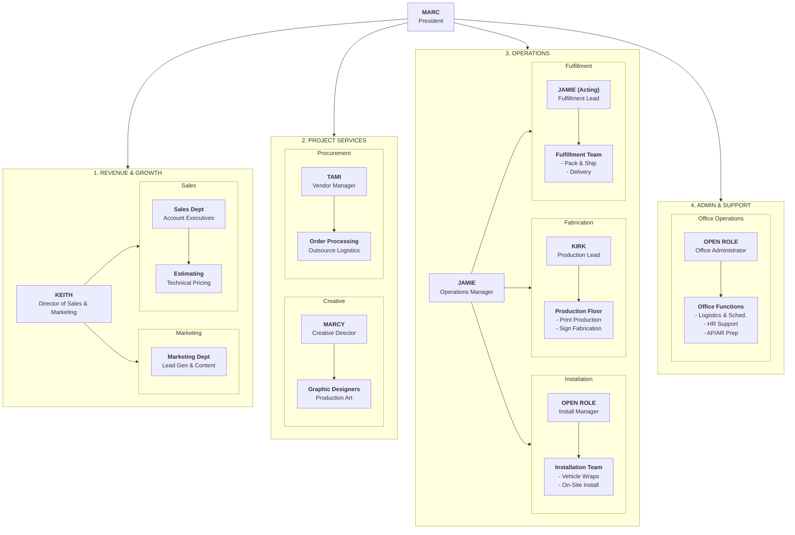

# Org Chart

*Source: Notion — https://www.notion.so/2e26abe00ba480ccb81ec14ddfd284f7 (YG Docs · Tags: Team)*

*(Originally a Yoder Graphics org chart — routed to GM LLC per user instruction)*

> Need to get a full list of 'departments' and role responsibilities before completing.

