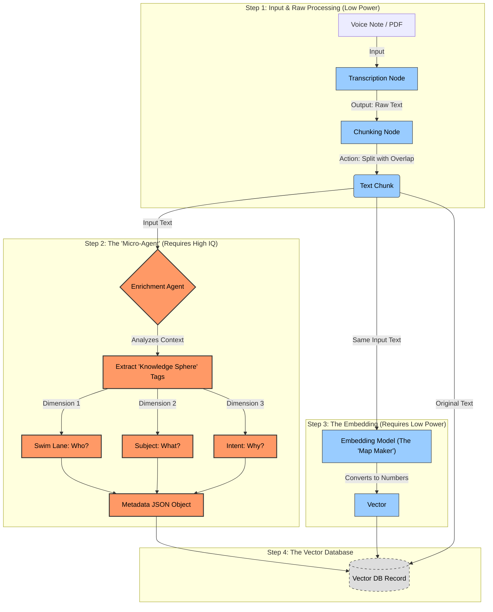
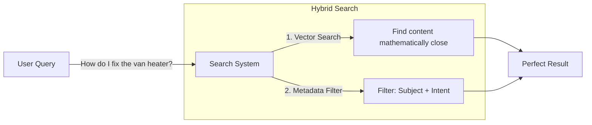
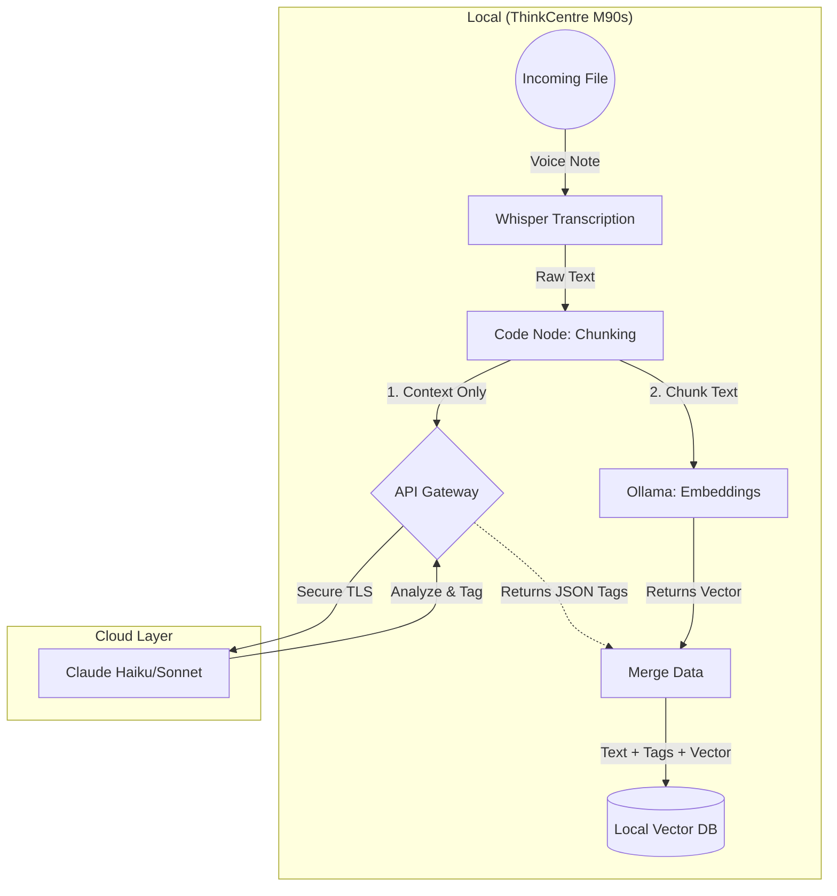

# Knowledge Spheres

*Source: Notion — https://www.notion.so/3026abe00ba480eea38cd4d300fef27a (Initiative Tracker)*

## Inputs
- Voice to text transcript
- Documents
- Video transcripts

## Schema
**Multi-dimension.** It is **not** a filing cabinet or folder. It is a set of tags we attach to every chunk.

Supposedly: Who, what, what-definition.

**Shift thinking from "Where do I file this?" to "What are its attributes?"**

- **Dimension 1: Swim Lane (Context)** — Who is this for? (Sales, Marketing, Operations, Art, Production, etc.)
- **Dimension 2: Subject (Noun)** — What specific thing are we talking about? (Latex Printer, Invoice, Vehicle Wrap, Forklift, Employees)
- **Dimension 3: Intent (Verb)** — What kind of knowledge is this? (SOP, Troubleshooting) — *this dimension is difficult to answer; "verb" or "intent" may need changing*

### Example JSON
```json
{
  "source_text": "Hey, when you're doing the final heat post...",
  "refined_content": "Ensure post-heating of deep channels on Sprinter vans reaches 180 degrees to prevent vinyl lifting.",
  "metadata": {
    "swim_lane": "Production",
    "subject": "Vehicle Wrap",
    "intent": "Troubleshooting",
    "tags": ["Sprinter Van", "Temperature", "Vinyl Failure"]
  }
}
```

## The Ingestion Pipeline



### Why this distinction matters for hardware
- **Blue Nodes (Low Power):** Whisper (Transcription) and Embedding Model run on a current Intel Ultra laptop. Efficient.
- **Orange Nodes (High IQ):** **Only** place you need the $4,000 Mac Studio or Dual RTX 4090s. The "Enrichment Agent" must intelligently tag messy sentences.

### The Retrieval Flow (Hybrid Search)



## Recommended Hardware

**System:** Lenovo ThinkCentre M90s Gen 6 (Intel) Small Form Factor (SFF)
- **CPU:** Intel® Core™ Ultra 5 225
- **OS:** Windows 11 Pro 64 (or Ubuntu 24.04 LTS)
- **Memory:** 32 GB DDR5-5600MHz (2×16 GB dual-channel)
- **GPU:** NVIDIA® GeForce RTX™ 3050 6GB GDDR6
- **Storage:** 1 TB SSD M.2 2280 PCIe Gen4
- **PSU:** 310W or 380W (required to support GPU)
- **Networking:** Intel® I219-LM + Wi-Fi 6E AX211

### Ubuntu Compatibility
- **Yes, it works.** Lenovo officially certified M90s Gen 6 for Ubuntu 24.04 LTS.
- **MUST install Ubuntu 24.04 LTS (Noble Numbat) or newer.** 22.04 uses kernel 5.15 which doesn't know E-cores or NPU.
- Ubuntu 24.04 ships with Kernel 6.8+ including initial support for your Intel Ultra chip.

## Local + Cloud Hybrid Architecture



**Architecture principle:** Only the chunk context (not the content) goes to cloud AI for tagging. Embeddings and storage stay local.
